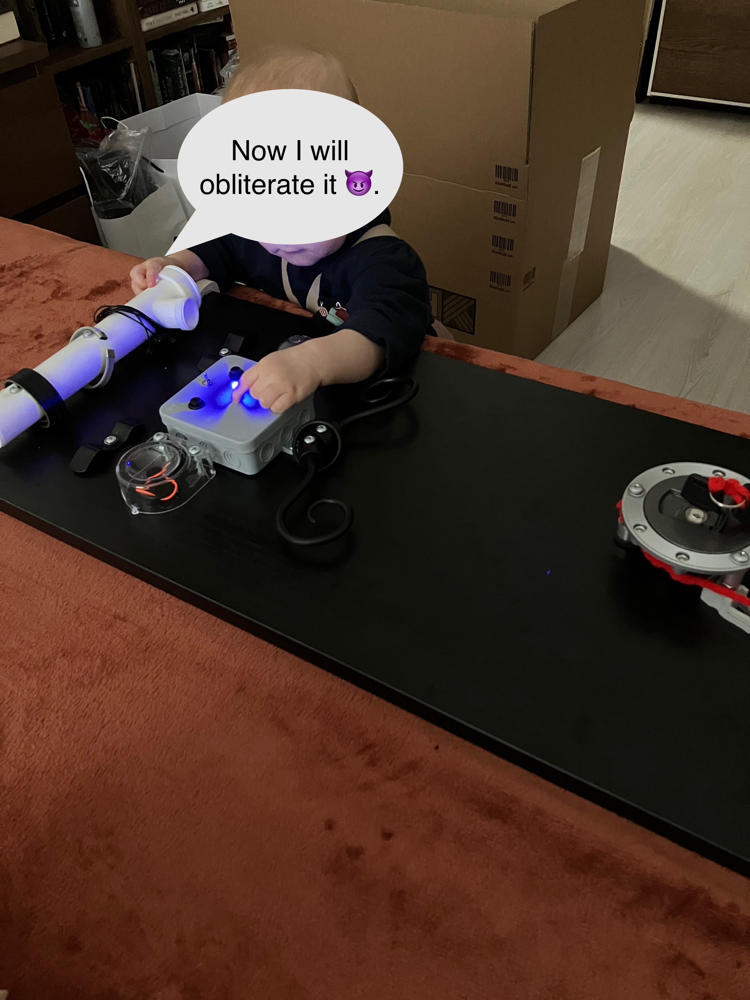

<!-- PROJECT LOGO -->
 

  <h1 align="center">🕹️ Busy Board</h3>

  

    Decrease your child’s boredom and yours as well.
     
    <a href="https://github.com/lipelix/busy-board/discussions/categories/general">Leave a comment in discussion</a>
  

<table>
    <tr>
        <td></td>
        <td></td>
    </tr>
</table>

<!-- ABOUT THE PROJECT -->
## About The Project

Bad weather, long afternoons, soft illnesses, all of these can be a reason for your child and you to get bored. There are plenty of toys or even busy (or activity) boards that you can grab in a store. But why not to make one by yourself?

(<a href="#top">back to top</a>)

### Built and Deploy

For this project, I used materials from my toolbox, debris, and some electronic components:
- 🔫 Drill
- ▲ Step drills to plastics
- 🪛 Screwdriver
- 🔩 Wood screws
- ⚡ Electric Soldering Iron
- ➿ Soldering wire
- 🪵 Wood board (residue from Ikea furniture)
- 📦 Wiring box
- 📏 Sanitary pipe
- 🔽 [MP1584EN Step-down Voltage module](https://dratek.cz/arduino/121945-mini-step-down-modul-3a-s-mp1584en.html) |  
- 🕹️ [Switch](https://www.laskakit.cz/packovy-prepinac-1-5a-250vac/) | 
- 🔋 [Battery box](https://www.laskakit.cz/bateriovy-box-3xaa-uzavreny-s-vypinacem/) | 
- 〰️ [Wires](https://www.laskakit.cz/propojovaci-vodice-10cm-20-kusu/) | 
- 💡 [LED Diode](https://www.aliexpress.com/item/32848810276.html?spm=a2g0o.order_list.order_list_main.183.1fa618027RoF5b) | 
- 🗜️ [LED Holder Socket](https://www.aliexpress.com/item/1005001382324665.html?spm=a2g0o.cart.0.0.235338da3UhIeb&mp=1) | 
- 💡 [Soft LED Filament](https://www.aliexpress.com/item/1005004500671003.html?spm=a2g0o.order_list.order_list_main.48.1fa618027RoF5b) | 
- Ω [Metal Resistor](https://www.aliexpress.com/item/1005006001789859.html?spm=a2g0o.order_list.order_list_main.52.1fa618027RoF5b) | 
- 🔘 [Push Button](https://www.aliexpress.com/item/1005007005387422.html?spm=a2g0o.productlist.main.1.48856GHv6GHvFr&algo_pvid=4d23ca8d-084e-49ec-9339-4d54cfb932f5&algo_exp_id=4d23ca8d-084e-49ec-9339-4d54cfb932f5-0&pdp_npi=4%40dis%21CZK%2130.26%2124.20%21%21%218.94%217.15%21%40210391a017356454703504742e9c0d%2112000039026847260%21sea%21CZ%21190867312%21X&curPageLogUid=0QeuhpcRADc8&utparam-url=scene%3Asearch%7Cquery_from%3A) | 

(<a href="#top">back to top</a>)

<!-- GETTING STARTED -->
## Getting Started

The first step was to grab all the stuff and make a plan. I wanted to have a board with some activities and lights. I wanted to have a switch to turn on/off the lights and a button because it reduces the risk that lights will be turned on all the time.

Most work will involve lights and wiring. I used a battery box to power the lights. I also used a switch to turn on/off the single Blue LED and two buttons to turn on the lights on each side.

Connect the LED to the breadboard (which provides a 3V power source) and put it on the board to see what it looks like. (Those transparent plastic things are from the packaging of the pacifier - they are perfect for this purpose)

In the following step, I added a Wiring box and put 🟦 LED to the middle of it (let's call it nose). Put 🟥 and 🟨 LED Filaments as eyes to the sides - it looks much better.

The next step was to create holes for buttons, switch to the Wiring box, and place batteries inside the Wiring box. I used a step drill to make a hole - it’s plastic, so it was easy. Grab a heat gun to catch the battery box inside the Wiring box.

💔 You can see that 🟦 LED does not fit the LED holder - because the holder is for 3mm LEDs, but I have a 5mm one. Never mind…

## Schema

The inside of the wiring box is a bit messy, but it functions well 🙃:
- The battery box is connected to a step-down voltage regulator.
- The negative output of the regulator connects to a resistor.
- Each LED branch with a button (or switch) connects to the positive terminal of the regulator and to the resistor in parallel.
 

### `01-15-2025`
---
- Fix the holder for the LED - use 5mm LED holder for 5mm LED 🙃
- Add Zpiper to the board - customer seems to like it 😈

<!-- ROADMAP -->
## Roadmap

- [x] Create basic structure
- [x] Make the lights work
  - [x] Add LEDs and buttons to the breadboard
  - [x] Add power source
  - [x] Solder all the stuff
- [x] Fix holder for LED
- [ ] Add More Activities
  - [ ] Old watches
  - [x] Zipper
  - [ ] Magnetically controlled LEDs
  - [ ] Rotating wheel

(<a href="#top">back to top</a>)

<!-- CONTACT -->
## Contact

Libor Váchal - [LinkedIn](https://www.linkedin.com/in/liborvachal/)

(<a href="#top">back to top</a>)

<!-- ACKNOWLEDGMENTS -->
## Acknowledgments

Valuable links and things worth mentioning.

* [Laskakit.cz](https://www.laskakit.cz/) - 🇨🇿 Czech e-shop with electronics (3 days delivery max)
* [Dratek.cz](https://www.dratek.cz/) - 🇨🇿 Czech e-shop with electronics (3 days delivery max)
* [Aliexpress](https://www.aliexpress.com/) - 🇨🇳 Chinese shop with everything (1-week delivery min if you are lucky)
* [Tinkercard](https://www.tinkercad.com/dashboard) - Online circuit simulator

(<a href="#top">back to top</a>)

